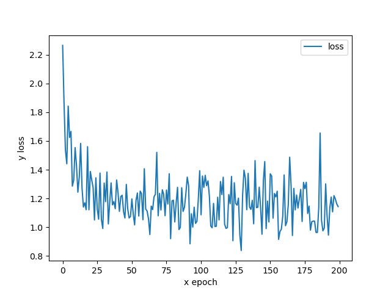

# 初步实现
1. 导入数据集
规范化数据集，每次输出一组数目为```batch_size```的图片，实现图像可视化，调用```print_img(number=1)```可批量打印图片
2. 神经网络设计（输入层+隐藏层+输出层）
INPUT-conv->C1(6@28x28)-subsamling->S2(6@14x14)-conv->C3(16@10x10)-subsampling->S4(16@5x5)-flatten->C5(120)-linear->F6(84)-linear->F7(84)->OUTPUT
深度CNN过程=输入->卷积池化->卷积池化->全连接->全连接->输出
3. 选择损失函数和更新策略
训练神经网络，损失函数=交叉熵，权重更新策略=Momentum优化下的SGD
4. 导入训练数据进行迭代更新
训练参数存储地址：```PATH = './cifar_net.pth'```
5. 导入测试数据，计算准确度
实现可以选择计算整体准确度或是分类别准确度函数```test_Net(eachclass=False)```
# 算法优化
* 整合运行函数，可以输出训练集和测试集准确率关于循环次数的变化曲线```print_list_img(l1,l2,epoch)```
1. 初始数据（89% vs 60%）
循环两次时训练集准确率为57%，测试集准确率为55%，为提高准确率同时保持较快的运行速度，调整batchsize=20，epoch=50，获得Accuracy of train network: 89 %，Accuracy of  test network: 60 %，记录为初始数据
2. 引入学习率衰减和GPU计算（95% vs 60%）
```scheduler = optim.lr_scheduler.StepLR(optimizer,step_size=5,gamma = 0.8)```
再次测试，调整batchsize=20，epoch=10，采用小批量计算验证算法正确性。获得准确率为95%和60%。由于train数据集下准确率与test数据集下准确率差距较大，检查学习过程发现学习过程直接导入了之前初始数据时的参数，使得学习率衰减其实并没有起到很大作用。
3. 纠正代码后更换学习率衰减策略
```scheduler = optim.lr_scheduler.ExponentialLR(optimizer, gamma=0.9)```
调整epoch=200，打印训练集损失函数图形如下

